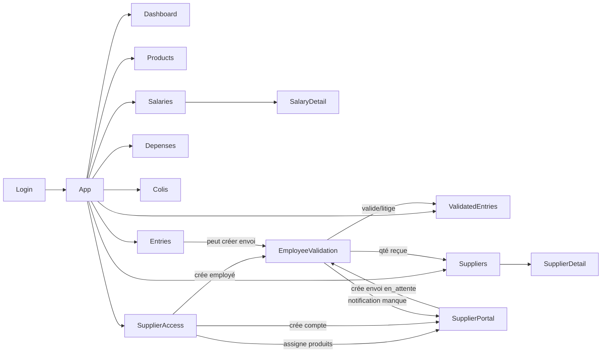

# Audit fonctionnel & UI — AutoGet (Cosmos Algérie)

**Date :** 2026-08-01  
**Périmètre :** lecture seule de `src/`, `sql/`, `supabase/`, config, docs.  
**Aucune modification applicative, SQL ou métier** dans le cadre de cet audit.

---

## 1. Synthèse produit

AutoGet est un ERP web React 19 + Vite + Tailwind + shadcn/ui + Supabase pour la gestion de marchandise (chaussures) de **Cosmos Algérie** :

- catalogue produits / prix d’achat (DA) ;
- fournisseurs, envois de stock, validation réception, litiges, notifications ;
- paiements fournisseurs et montants dus ;
- dépenses, colis envoyés ;
- salariés, acomptes, fiche de paie, clôture mensuelle ;
- authentification multi-rôles (admin, user, fournisseur, employé).

**Mode actif :** `USE_SUPABASE = true` (`src/config/index.js`).  
**Déploiement :** Vercel (`vercel.json`) → build Vite → `dist/`.  
**Navigation :** pas de React Router — état `activeView` dans `App.jsx` + `Sidebar`.

---

## 2. Carte des rôles

| Rôle | Valeur DB | Création | Landing | Navigation |
|------|-----------|----------|---------|------------|
| **admin** | `admin` | Signup (+ mdp admin `albator`) ou seed SQL | `dashboard` | Menu complet |
| **user** | `user` | Signup (défaut) | `dashboard` | Même menu que admin |
| **fournisseur** | `fournisseur` | Admin → Accès fournisseurs (`createCompte`) | `supplier-portal` | Uniquement « Mon espace » |
| **employe** | `employe` | Admin → Accès fournisseurs (`createCompte`) | `employee-validation` | Uniquement « Valider marchandise » |

### Helpers (`AuthContext.jsx`)

- `isAdmin()`, `isUser()`, `isFournisseur()`, `isEmploye()`, `isAuthenticated`
- Session : `localStorage.auth_user`
- Login Supabase : table `comptes` (`active=true`, mot de passe en clair)
- Fallback local : `auth_accounts` si `USE_SUPABASE=false`

### Matrice d’accès (pratique)

| Capacité | admin | user | fournisseur | employe |
|----------|:-----:|:----:|:-----------:|:-------:|
| Menu inventaire / opérations | ✓ | ✓ | — | — |
| Supprimer (produits, entrées, salaires…) | ✓ | UI masquée | — | — |
| Écran Fournisseurs (hard gate) | ✓ | bloqué | — | — |
| Accès & assignations (hard gate) | ✓ | bloqué | — | — |
| Entrées validées (hard gate) | ✓ | bloqué | — | — |
| Portail fournisseur | via nav | via nav | ✓ défaut | — |
| Validation employés | via nav | via nav | — | ✓ défaut |
| Créer comptes fournisseur/employé | ✓ | bloqué | — | — |

**Points d’attention :**

1. `user` a le **même menu** qu’admin, mais mutations destructives masquées et 3 écrans hard-gate.
2. `renderView()` **ne vérifie pas le rôle** : seul le Sidebar + redirect initial + hard gates locaux protègent.
3. Badge `TopHeader` affiche toujours « Admin » (ignore le rôle réel).
4. Docs auth historiques = 2 rôles ; code + migration = **4 rôles**.

---

## 3. Carte des écrans

### 3.1 Authentification

| Écran | Fichier | Rôle |
|-------|---------|------|
| Connexion | `Login.jsx` | Identifiants → `login()` |
| Inscription | `Signup.jsx` | Rôles `user` \| `admin` uniquement |

### 3.2 Shell applicatif

| Élément | Fichier | Notes |
|---------|---------|-------|
| Sidebar | `Sidebar.jsx` | Nav par rôle |
| TopHeader | `TopHeader.jsx` | Menu mobile, avatar, logout |
| AppHeader / Navigation | `AppHeader.jsx`, `Navigation.jsx` | **Non montés** (legacy) |

### 3.3 Vues `activeView` (`App.jsx`)

| `activeView` | Composant | Contenu principal |
|--------------|-----------|-------------------|
| `dashboard` | `Dashboard.jsx` | Stats globales, périodes, produits, entrées/paiements récents, export |
| `products` | `Products.jsx` | CRUD produits (prix achat DA) |
| `entries` | `Entries.jsx` | Création/liste entrées stock, filtres, détection doublons (SB) |
| `validated-entries` | `ValidatedEntries.jsx` | Entrées `valide`/`litige`, édition qté reçue (admin) |
| `suppliers` | `Suppliers.jsx` → `SupplierDetail.jsx` | Liste fournisseurs, paiements, détail |
| `depenses` | `Depenses.jsx` | Dépenses + catégories |
| `colis` | `Colis.jsx` | Colis envoyés |
| `salaries` | `Salaries.jsx` → `SalaryDetail.jsx` | Salariés, acomptes, clôture, fiche de paie |
| `supplier-portal` | `SupplierPortal.jsx` | Vue fournisseur : overview, envois, créer, notifications |
| `employee-validation` | `EmployeeValidation.jsx` | File d’attente `en_attente` → valide/litige |
| `supplier-access` | `SupplierAccess.jsx` | Assignations produits + création comptes |

### 3.4 Dépendances entre écrans



---

## 4. Parcours par rôle

### Admin

1. Login → Dashboard  
2. Produits → créer/éditer/supprimer  
3. Accès fournisseurs → assigner produits + créer comptes fournisseur/employé  
4. Entrées (admin) ou Portail fournisseur → envois  
5. Validation employés → réception  
6. Entrées validées → correction éventuelle  
7. Fournisseurs → montants dus + paiements  
8. Dépenses / Colis / Salariés (acomptes, clôture, fiche de paie)

### User

1. Login → Dashboard  
2. Accès lecture/écriture sur produits, entrées, dépenses, colis, salariés  
3. **Pas** de suppression UI ; **pas** d’accès Fournisseurs / Accès / Entrées validées  
4. Peut ouvrir Portail / Validation via la nav (pas de hard gate interne)

### Fournisseur

1. Login → Portail (`fournisseur_id` obligatoire)  
2. Overview (vue `v_fournisseur_dashboard`)  
3. Créer un envoi (produits assignés uniquement) → `en_attente`  
4. Consulter envois + notifications manques

### Employé

1. Login → Validation  
2. Liste `en_attente` → saisir qté reçues → Confirmer  
3. Résultat `valide` ou `litige` + notification éventuelle

---

## 5. Flux métier détaillés

### 5.1 Fournisseur

1. Admin : `Suppliers` → `addFournisseur(nom, contact, adresse)` → `fournisseurs`  
2. Soft-delete : `deleted_at` + désactivation `comptes` liés  
3. Compte portail : `SupplierAccess` → `createCompte({ role:'fournisseur', fournisseur_id })`

### 5.2 Assignation produits

1. `SupplierAccess` : `assignProduit` / `unassignProduit` sur `produit_fournisseur`  
2. Portail ne liste que les produits assignés (`fetchProduitsAssignes`)

### 5.3 Envoi fournisseur

1. `SupplierPortal.handleSubmitEnvoi` → `addEntreeWithLines`  
2. INSERT `entrees` (`statut:'en_attente'`, `paye:false`, `created_by`)  
3. INSERT `entree_lignes` (`produit_id`, `quantite` ; pas encore `quantite_recue`)  
4. Webhook n8n possible sur INSERT `entrees`

### 5.4 Validation réception

1. `EmployeeValidation` : `fetchEntreesEnAttente`  
2. Saisie `quantite_recue` (défaut = qté envoyée)  
3. `validateEntree` :
   - UPDATE lignes `quantite_recue`
   - `statut = totalManquePaires > 0 ? 'litige' : 'valide'`
   - `validated_at`, `validated_by`
4. Si manques → INSERT `notifications` (`type:'manque'`, `montant_manque`, `paires_manquantes`)

**Statuts fermés :** `en_attente` | `valide` | `litige`

### 5.5 Montants dus & paiements

| Source | Formule |
|--------|---------|
| Vue SQL portail | `montant_du = valeur_recue(statut=valide) − total_paye` |
| Admin Suppliers/Detail | Entrées comptables = `statut ≠ en_attente` ; valeur = `Σ(qte_recue × prix)` ; `reste = due(non payées) − Σ(paiements)` |

Paiement : `addPaiement(fournisseur_id, montant, date, description)`.

**Note :** `entrees.paye` n’est quasiment jamais basculé à `true` en mode Supabase.

### 5.6 Salariés & acomptes

1. CRUD `salaries`  
2. Acomptes : `addAcompte` + `mois_annee = YYYY-MM`  
3. Soft-delete individuel : `deleted_at`  
4. Actions rapides : Retard (+500), Absence (+1500), Bonus (−1000, signe négatif)  
5. Solde mois : `salaire_mensuel − Σ(acomptes du mois)`  
6. Fiche de paie : sélection de mois historique + impression

### 5.7 Clôture mensuelle

1. Manuel : bouton « Clôturer le mois »  
2. Auto (fragile) : 1er du mois si page Salariés ouverte  
3. Comportement actuel : UPSERT `salary_history` — **les acomptes restent en base**  
4. Undo : suppression du snapshot `salary_history` du mois (pas des acomptes)  
5. UI travail : filtre sur mois calendaire courant ; historique consultable/imprimable

### 5.8 Dépenses & colis

- Dépenses : CRUD + catégories (`depense_categories`) ; webhook n8n sur INSERT  
- Colis : CRUD `nombre`, `date`, `description` ; stats sur volumes

---

## 6. Modèle de données Supabase

### 6.1 Tables

| Table | Rôle | Relations clés |
|-------|------|----------------|
| `produits` | Catalogue | ← variantes, entree_lignes, produit_fournisseur |
| `variantes` | Variantes produit | → produits |
| `fournisseurs` | Fournisseurs | Soft-delete app via `deleted_at` (hors SQL repo) |
| `entrees` | Envois / entrées | → fournisseurs ; statut validation |
| `entree_lignes` | Lignes | → entrees, produits/variantes ; `quantite_recue` |
| `paiements` | Paiements FO | → fournisseurs |
| `depenses` | Dépenses | `categorie_id` (app) |
| `depense_categories` | Catégories | Utilisée app ; **pas de CREATE dans sql/ repo** |
| `colis` | Colis | RLS enabled (auth Supabase) |
| `salaries` | Salariés | ← acomptes, salary_history |
| `acomptes` | Acomptes | → salaries ; `mois_annee` ; soft-delete app |
| `salary_history` | Snapshots mensuels | UNIQUE `(salary_id, mois_annee)` |
| `comptes` | Auth custom | rôles 4 valeurs ; `fournisseur_id` optionnel |
| `produit_fournisseur` | Assignation | UNIQUE (produit, fournisseur) |
| `notifications` | Alertes manques | → fournisseurs, entrees |

### 6.2 Vues

| Vue | Usage |
|-----|-------|
| `v_entree_lignes_detail` | Détail lignes, prix, qté envoyée/reçue/manquante, valeurs |
| `v_fournisseur_dashboard` | Agrégats portail : paires, valeurs, `montant_du` |

**Particularité vue :** `qte_manquante` / `valeur_manquante` calculées seulement si `statut = 'valide'`. Or l’app marque les manques en **`litige`** → les manques agrégés de la vue peuvent rester à 0 (la notification porte alors les montants).

### 6.3 RLS

- Majorité des tables : RLS **désactivé** (scripts SQL)  
- `colis` : RLS **activé** (policies `auth.role() = authenticated`) — peut entrer en conflit avec auth custom `comptes`

### 6.4 Opérations DataContextSupabase (résumé)

Lectures : `fetchProduits`, `fetchFournisseurs`, `fetchEntrees`, `fetchPaiements`, `fetchDepenses`, `fetchDepenseCategories`, `fetchColis`, `fetchSalaries`, `fetchAcomptes`, `fetchSalaryHistory`, `fetchEntreeDetails`, `fetchProduitsAssignes`, `fetchAssignations`, `fetchEntreesEnAttente`, `fetchEntreesValidees`, `fetchEntreeLignesDetail`, `fetchEnvoisFournisseur`, `findEnvoiDoublon`, `fetchNotifications`, `fetchFournisseurDashboard`.

Écritures : CRUD produits/fournisseurs/paiements/dépenses/catégories/colis/salaires/acomptes ; `addEntreeWithLines` ; `assignProduit`/`unassignProduit` ; `validateEntree` ; `resetAllAcomptes`/`undoResetAcomptes` ; `createCompte` ; `markNotificationRead`.

### 6.5 Migrations / scripts SQL notables

- `sql/migration-acces-fournisseur-employe.sql` — extension canonique (rôles, assignation, validation, notifications, vues)  
- `sql/create-tables-complet.sql` — salaires / acomptes / history  
- `supabase/migrations/20251030101316_n8n_webhooks_on_insert.sql` — webhooks WhatsApp stock

### 6.6 Écarts schéma repo ↔ app

Colonnes/tables utilisées par le code mais absentes des scripts SQL versionnés :

- `fournisseurs.deleted_at`
- `acomptes.deleted_at`
- `depense_categories` + `depenses.categorie_id`

---

## 7. Calculs financiers & statistiques

### Dashboard

| Métrique | Formule |
|----------|--------|
| Valeur catalogue | `Σ(prix_achat)` produits |
| Valeur entrées | hors `en_attente` ; `Σ(qte_recue × prix)` |
| Solde global | `Σ(paiements) − Σ(valeur entrées non payées)` |
| Taux paiement | ratios valeur/count payées |
| Périodes | today / week / month via `filterByPeriod` |

### Fournisseurs (admin)

| Métrique | Formule |
|----------|--------|
| Valeur entrée | 0 si `en_attente` ; sinon `Σ(qte_recue × prix)` |
| Total dû | somme entrées comptables « non payées » |
| Total payé | `Σ(paiements)` |
| Reste | `totalDue − totalPaye` |

### Portail fournisseur

Champs vue : `paires_envoyees`, `paires_recues`, `paires_manquantes`, `valeur_recue`, `valeur_manquante`, `total_paye`, `montant_du`.

### Salaires

| Métrique | Formule |
|----------|--------|
| Total acomptes mois | `Σ(montant)` filtrés `mois_annee` |
| Solde | `salaire_mensuel − total_acomptes` |
| Snapshot clôture | idem → `salary_history` |
| Fiche de paie | déductions (montant > 0) / primes (montant < 0) sur le mois choisi |

### Dépenses / Colis

- Dépenses : totaux, moyenne, regroupement catégorie, stats périodes  
- Colis : `Σ(nombre)`, min/max/moyenne, taux d’activité

---

## 8. Mode Supabase vs localStorage

| Aspect | Local (`USE_SUPABASE=false`) | Supabase (actuel) |
|--------|------------------------------|-------------------|
| Stockage | `gestion_marchandise_data` + reducer | Postgres via client |
| Forme données | camelCase, lignes imbriquées | snake_case, tables normalisées |
| IDs | `id_timestamp_…` | UUID |
| Validation / litige / notifications | **Absent** | Complet |
| Portail / Accès / Entrées validées | Écrans bloqués ou inutiles | Complet |
| Soft-delete fournisseurs | Non | Oui |
| Catégories dépenses | Inférées du `nom` | Table dédiée |
| Clôture / salary_history | Limité / absent | Complet |
| Auth | `auth_accounts` local | Table `comptes` |
| Variantes | ActionTypes existent, UI produits limitée | Table présente, UI produit-niveau |

Les écrans dual-path adaptent via :  
`dataCtx?.state ?? { produits: dataCtx?.produits ?? [] }` et `prix_achat ?? prixAchat`.

---

## 9. Composants shadcn/ui

**Config :** `components.json` — style `new-york`, baseColor `stone`, CSS variables, icons Lucide, alias `@/`.

**Tailwind :** `darkMode: ["class"]`, tokens shadcn (sidebar, chart, radius), plugin `tailwindcss-animate`. Thème forcé dark au démarrage (`main.jsx`).

| Composant `ui/` | Utilisé | Non utilisé |
|-----------------|---------|-----------|
| alert | Signup | |
| badge | Nombreux écrans | |
| button | Quasi tous | |
| card | Quasi tous | |
| dialog | CRUD modals | |
| dropdown-menu | TopHeader (AppHeader legacy) | |
| input | Formulaires | |
| label | Login, Signup | |
| separator | Stats / layouts | |
| sheet | Sidebar mobile | |
| textarea | Descriptions | |
| toast / toaster | Global + Salaries (ToastAction) | |
| avatar | | ✓ |
| table | | ✓ |
| popover | | ✓ |
| navigation-menu | | ✓ |
| command | | ✓ (interne dialog seulement) |

**Orphelins applicatifs :** `AppHeader.jsx`, `Navigation.jsx`, `PeriodStatsCards.jsx` (non branchés dans `App.jsx`).

---

## 10. Comportements interdits de casser (non-régression)

### Auth & rôles

- Login / logout / session `auth_user`  
- Redirect fournisseur → portail ; employé → validation ; autres → dashboard  
- Hard gates admin : Suppliers, SupplierAccess, ValidatedEntries  
- Masquage suppressions pour non-admin  
- Lien `comptes.fournisseur_id` pour le portail

### Stock & fournisseurs

- Création entrée avec `statut: en_attente`  
- Assignation `produit_fournisseur` limite le catalogue portail  
- Validation : mise à jour `quantite_recue` + statut `valide`/`litige`  
- Notification `manque` si paires manquantes  
- Exclusion des `en_attente` des calculs « comptables » admin  
- Soft-delete / restore fournisseurs (+ comptes liés)

### Finance

- Formules reste / montant_du / solde salaires  
- Paiements fournisseurs  
- Acomptes avec `mois_annee`  
- Clôture = snapshot `salary_history` **sans** effacer les acomptes  
- Impression fiche de paie multi-mois  
- Devise DA et formats numériques existants

### Technique

- Toggle `USE_SUPABASE` + adapters dual-path  
- Build Vite / alias `@`  
- Toasts d’actions critiques (clôture, validation)

---

## 11. Incohérences & risques repérés

> **Hors scope redesign UI/UX.**  
> Les items R1–R14 sont des **dettes métier / technique / sécurité**.  
> Ils doivent rester **documentés et inchangés** pendant tout travail de design system, navigation ou redesign d’écrans, **sauf autorisation explicite** du product owner pour corriger un risque nommé.

### 11.1 Tableau des risques (ne pas corriger sans autorisation)

| ID | Catégorie | Risque | Impact |
|----|-----------|--------|--------|
| R1 | Métier / calcul | Vue SQL manques seulement si `valide`, app utilise `litige` | Portail : manques agrégés souvent à 0 |
| R2 | Métier / calcul | Admin `reste` inclut litige ; portail `montant_du` = valide seul | Écarts de montants dus |
| R3 | Métier / données | `entrees.paye` jamais mis à `true` en SB | « Non payé » ≈ toutes les entrées comptables |
| R4 | Sécurité / auth | Pas de hard guard sur `activeView` | Fournisseur/employé pourraient atteindre d’autres vues si état forcé |
| R5 | Auth / droits | `user` ≈ admin en navigation | Confusion droits / surface d’attaque UX |
| R6 | Sécurité | Mot de passe en clair dans `comptes` | Sécurité |
| R7 | Schéma SQL | Schéma SQL repo ≠ colonnes app (`deleted_at`, catégories) | Onboarding / drift |
| R8 | Infra / RLS | RLS `colis` vs auth custom | Échecs CRUD colis possibles |
| R9 | Bug code | `SupplierDetail.addPaiement(payload)` vs signature positionnelle context | Bug potentiel paiement détail |
| R10 | Métier / fiabilité | Clôture auto dépend du navigateur + localStorage | Non fiable |
| R11 | Métier / cohérence | `ValidatedEntries` ne recalcule pas statut/notifications après édition | Litige/valide / notifs obsolètes |
| R12 | UX trompeuse (lié auth) | TopHeader badge « Admin » hardcodé | Badge rôle incorrect |
| R13 | Documentation | Docs auth = 2 rôles | Doc obsolète |
| R14 | Dette code | Composants UI/app orphelins | Confusion redesign |

### 11.2 Séparation stricte : risques vs travaux UI/UX

| Travaux UI/UX autorisés (après validation) | Interdit sans autorisation explicite |
|--------------------------------------------|--------------------------------------|
| Design system (tokens, typo, couleurs, radius) | Corriger R1–R11, R13 (métier, SQL, auth, calculs) |
| Shell : Sidebar, TopHeader, layout commun | Changer le champ / logique `paye` (R3) |
| Composants partagés shadcn / wrappers présentation | Modifier le cycle `en_attente → valide/litige` |
| Redesign **visuel** des pages métier (plus tard) | Modifier le schéma SQL (R7) |
| Correction purement cosmétique du badge rôle **uniquement si autorisé** (R12) | « Corriger » les écarts portail vs admin (R1, R2) |
| Nettoyage orphelins **uniquement si autorisé** (R14) | Renforcer les guards d’auth (R4, R5, R6) |

**Règle opérationnelle :** tout ticket redesign doit lister « risques non touchés : R1–R14 » ; toute exception doit citer l’ID (ex. « autorisé : R12 uniquement »).

---


## 12. Checklist de tests de non-régression

### Auth

- [ ] Login admin / user / fournisseur / employé  
- [ ] Login compte `active=false` refusé  
- [ ] Redirect landing correct par rôle  
- [ ] Logout nettoie la session  
- [ ] Signup user ; signup admin avec `albator`

### Admin — inventaire

- [ ] CRUD produit (create/edit/delete)  
- [ ] Créer entrée stock ; filtre ; stats  
- [ ] Détection doublon envoi (SB)  
- [ ] Soft-delete / restore fournisseur

### Flux fournisseur → validation

- [ ] Assigner / désassigner produit  
- [ ] Créer compte fournisseur lié  
- [ ] Portail : créer envoi → apparaît en `en_attente`  
- [ ] Employé : valider qté = envoyée → `valide`  
- [ ] Employé : qté < envoyée → `litige` + notification  
- [ ] Marquer notification comme lue  
- [ ] Entrées validées : édition qté reçue

### Finance fournisseurs

- [ ] Calcul reste admin vs overview portail (noter écarts connus R1/R2)  
- [ ] Ajouter / supprimer paiement (liste + détail)  
- [ ] Dashboard : solde, périodes, export

### Salaires

- [ ] CRUD salarié  
- [ ] Ajouter acompte / retard / absence / bonus  
- [ ] Solde mois courant  
- [ ] Clôturer mois → `salary_history` créé, acomptes toujours présents  
- [ ] Undo clôture (snapshot retiré)  
- [ ] Sélecteur mois + impression fiche (mois historique)

### Dépenses / Colis

- [ ] CRUD dépense + catégorie (blocage delete si utilisée)  
- [ ] CRUD colis + stats

### Droits

- [ ] User : pas de boutons supprimer ; hard gate Fournisseurs / Accès / Validées  
- [ ] Fournisseur : nav limitée au portail  
- [ ] Employé : nav limitée à la validation  
- [ ] Portail sans `fournisseur_id` : message « compte non configuré »

### Technique

- [ ] Build production `npm run build`  
- [ ] Smoke Vercel après déploiement  
- [ ] (Optionnel) `USE_SUPABASE=false` : CRUD basique produits/entrées/salaires sans écrans SB-only

---

## 13. Inventaire fichiers clés

```
src/App.jsx
src/main.jsx
src/config/index.js
src/config/supabaseClient.js
src/context/AuthContext.jsx
src/context/UnifiedDataContext.js
src/context/DataContext.jsx
src/context/DataContextSupabase.jsx
src/components/{Login,Signup,Sidebar,TopHeader,Dashboard,Products,Entries,
  ValidatedEntries,Suppliers,SupplierDetail,Depenses,Colis,Salaries,
  SalaryDetail,SupplierPortal,EmployeeValidation,SupplierAccess}.jsx
src/components/ui/*
src/utils/dateUtils.js
sql/migration-acces-fournisseur-employe.sql
sql/create-tables-complet.sql
sql/supabase-schema*.sql
supabase/migrations/20251030101316_n8n_webhooks_on_insert.sql
package.json / components.json / tailwind.config.js / vite.config.js / vercel.json
```

---

## 14. Conclusion de l’étape 1

Le produit est un ERP multi-rôles centré sur le cycle **assignation → envoi → validation → litige/notification → paiement**, avec modules annexes **dépenses / colis / paie**.

La base fonctionnelle à préserver avant tout redesign UI :

1. les 4 rôles et leurs landings ;  
2. le cycle de statut `en_attente → valide|litige` ;  
3. les calculs de soldes fournisseurs et salaires ;  
4. la conservation des acomptes après clôture + impression multi-mois ;  
5. le dual-path Supabase / localStorage.

Les risques R1–R14 ci-dessus sont **documentés, non corrigés** (contrainte de cette étape).

**Prochaine étape (hors scope actuel) :** cadrage du redesign UI sans altérer ces comportements — à valider explicitement avant toute modification de composants.
